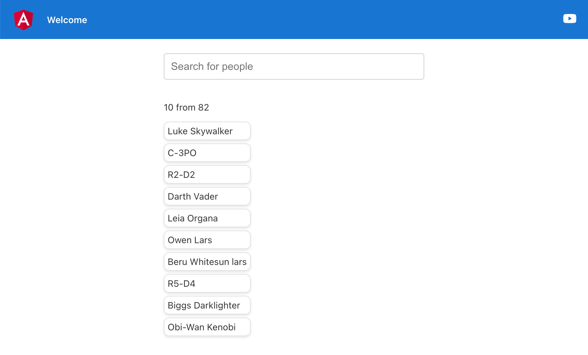

# Rxjs-Interop

## Docs

- [@angular/core/rxjs-interop](https://angular.dev/guide/signals/rxjs-interop)
- [swapi API](https://swapi.dev/)

This project was generated with [Angular CLI](https://github.com/angular/angular-cli) version 17.3.8.

## Development server

Run `ng serve` for a dev server. Navigate to `http://localhost:4200/`. The application will automatically reload if you change any of the source files.

## Screens

 #### On first load

 - the page is not empty - loading first page from Swapi Api

 #### On search
- the page update with relevant results

 #### On search clearance
 - the page is not empty - loading first page from Swapi Api as fisrt image

#### On search with no match
 